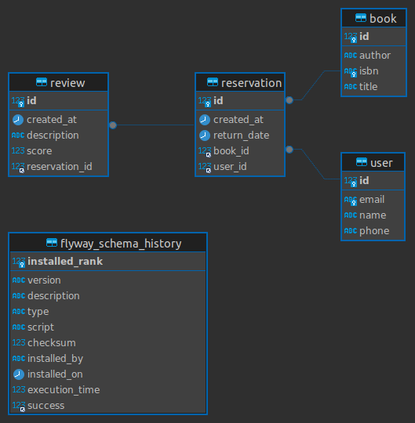

# Backend Library Application

This project is a Java-based backend application for an online library system. It provides endpoints for managing books, reservations, user reviews, and user registration. 
The application is built using Spring Boot and incorporates various technologies to ensure scalability, performance, and maintainability.
## Database ER Model



## Technologies Used

- Java 21
- Spring Boot 3.2.5
- Spring Data JPA
- Spring Data Redis
- Spring Actuator
- Lombok
- Flyway for database migration
- MySQL Connector
- Redis for caching
- Docker for containerization

## Running the Application with Docker

To run the application using Docker, follow these steps:

1. Clone the repository to your local machine:

   ```shell
   git clone <repository-url>
   ```

2. Navigate to the project directory:

   ```shell
   cd <project-directory>
   ```

3. Create a `.env` file in the project directory with the following environment variables:

   ```plaintext
   MYSQLDB_DATABASE=<your-mysql-database-name>
   MYSQLDB_USER=<your-mysql-username>
   MYSQLDB_PASSWORD=<your-mysql-password>
   MYSQLDB_ROOT_PASSWORD=<your-mysql-root-password>
   MYSQLDB_LOCAL_PORT=<your-local-mysql-port>
   MYSQLDB_DOCKER_PORT=<your-docker-mysql-port>
   REDIS_LOCAL_PORT=<your-local-redis-port>
   REDIS_DOCKER_PORT=<your-docker-redis-port>
   SPRING_LOCAL_PORT=<your-local-spring-port>
   SPRING_DOCKER_PORT=<your-docker-spring-port>
   ```

4. Run the following Docker Compose command to start the MySQL, Redis, and the application containers:

   ```shell
   docker-compose up --build
   ```

5. The application will start, and you can access it at `http://localhost:<your-local-spring-port>`.

## API Endpoints

The application exposes the following REST endpoints:

- `/books`: CRUD operations for managing books.
- `/reservation`: Endpoint for creating book reservations.
- `/reviews`: Endpoint for submitting and retrieving book reviews.
- `/users`: Endpoint for user registration.

For detailed information about each endpoint and its request/response format, 
please refer to the source code or the API documentation.

## Swagger Documentation

You can explore the API documentation using Swagger UI. 
Access the Swagger UI
by navigating to `http://localhost:<your-local-spring-port>/swagger-ui/index.html`  in your browser.

## Actuator Endpoints

The application also provides Actuator endpoints for monitoring metrics, health checks, and more. You can access the Actuator endpoints by navigating to `http://localhost:<your-local-spring-port>/actuator`.

Here are some useful Actuator endpoints:

- `/actuator/health`: Check the health status of the application.
- `/actuator/info`: Get information about the application.
- `/actuator/metrics`: View various metrics such as JVM memory usage, garbage collection statistics, and HTTP request metrics.
